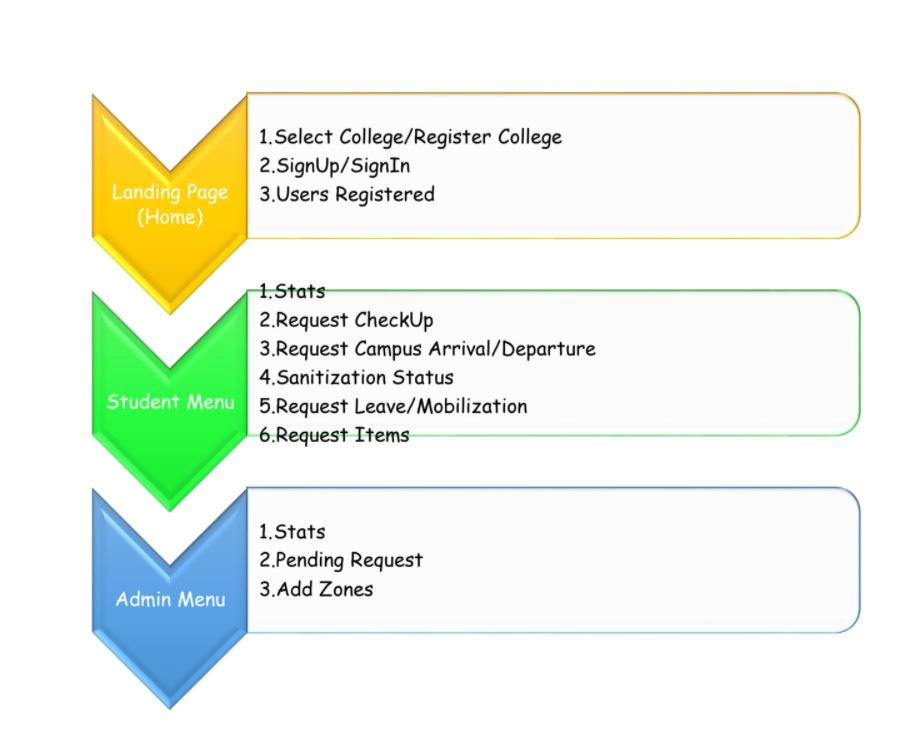
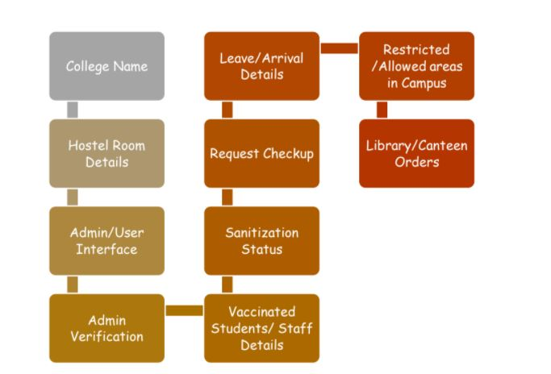
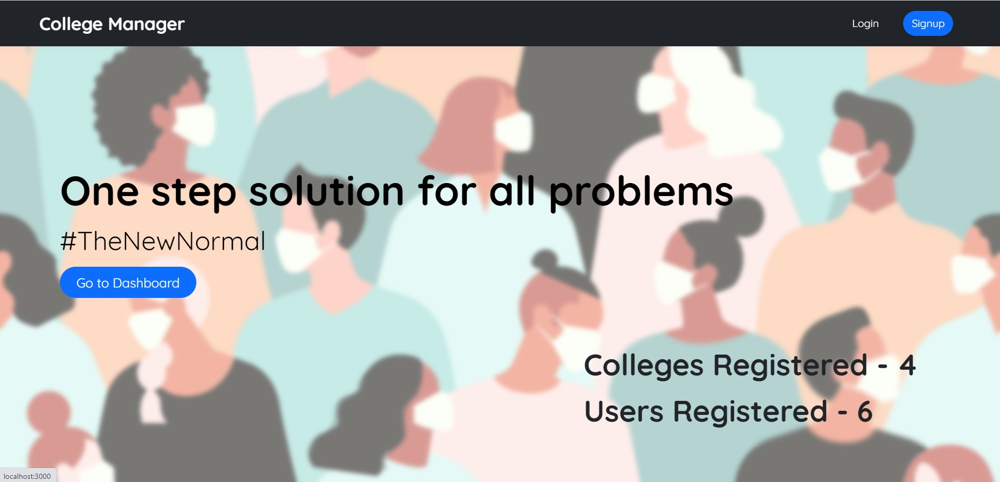
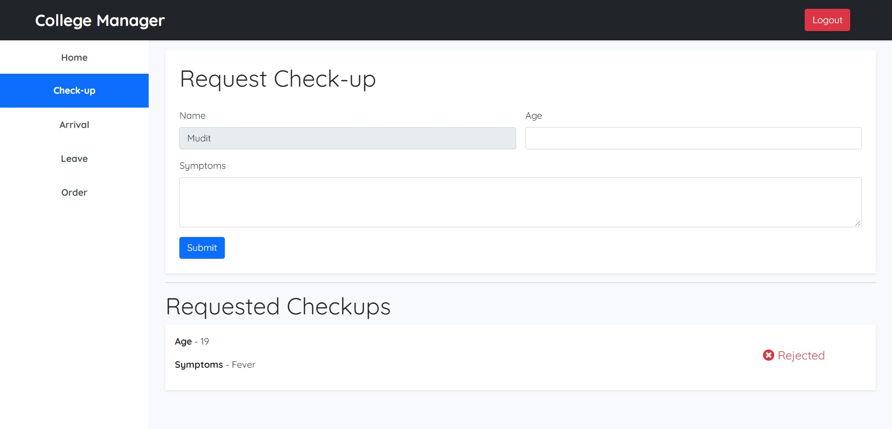
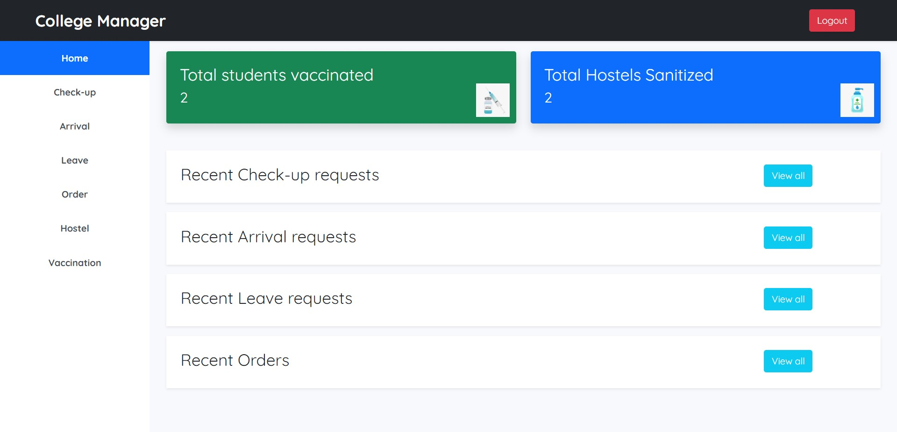
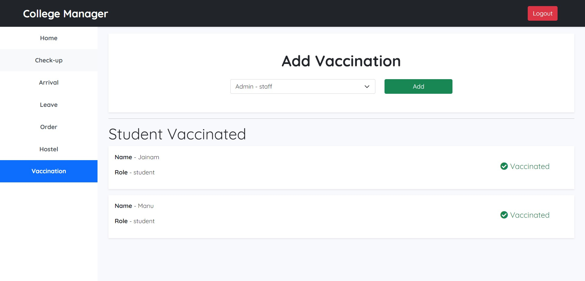
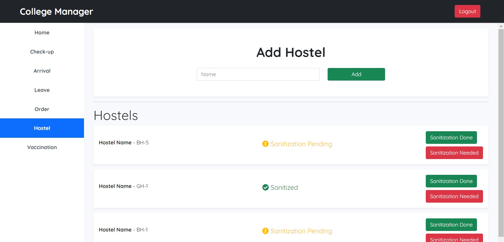

# githubhackathon
<h1>Let's Login..</h1></a>

<h4>Team Name : Wonder Moon </h4>
<h4>Team Members:  Lokitha.K (B.Tech IT) 
                  Kokila.M (B.Tech CSBS)
</h4>
<h4> Project Name:- Let's Login</h4>

<h2>Project Description:</h2>

  The website primarily focuses on controlling the chaos inside the college campus. It helps the college authority to maintain discipline and manage students in college in an easy way by providing an all-in-one platform for managing all kinds of activities related to students and colleges inside the college campuses. It also helps in managing college in pandemic situations like COVID by not allowing many students to gather at one place.
Challenges we ran into
We faced problems in linking all models between students and staff and making it easy to understand and to grant permission.
It was very difficult to manage this much data and to connect and interlink every piece of information with each other.
Time management was also a big deal for us.

<h2>Tech Stacks</h2>
<h3>
<ul>
  <li>HTML5</li>
  <li>CSS 3</li>
  <li>BOOTSTRAP</li>
  <li>MongoDB</li>
  <li>Nodejs</li>
  <li>Typescript</li>
  <li>Heroku</li>
  <li>Express Js</li>
  </ul>
</h3>

<h2>Functions in the Applications</h2>  
<b>College Covid Tracker</b>  
1.	College Name  
2.	Hostel Room Details  
3.	Admin/User Interface  
4.	Admin Verification  
5.	Vaccinated Students/ Staff Details  
6.	Sanitization Status  
7.	Request Checkup  
8.	Leave/Arrival Details  
9.	Restricted /Allowed areas in Campus  
10.	Library/Canteen Orders  
<b>Technologies-</b>  
HTML, CSS, JAVASCRIPT, NodeJS, MongoDB  
<b>Application<b>  
<b>Landing Page-<b>  
1.	Select College/Register College  
2.	SignUp/SignIn  
3.	Users Registered  
<b>Menu-Student<b>  
1.	Stats  
2.	Request CheckUp  
3.	Request Campus Arrival/Departure  
4.	Sanitization Status  
5.	Request Leave/Mobilization  
6.	Request Items  
<b>Menu-Staff <b> 
1.	Stats  
2.	Pending Request  
3.	Add Zones  

<h2>Working Models 👇</h2>
     

<h2>Outputs:</h2>

   

    

<h2>In Short :</h2>
<ul>
<li> We provide a User Friendly Beautiful UI.</li>
<li> It is Super Easy to Use and Gives User the Freedom for any Query.</li>
<li> Visual Analysis is Provided regarding the Live Data Fetched.</li>
<li> The Common Ideas talked about are shown as a WordCloud.</li>
<li> Recent Positive, Negative and Neutral Tweets are also Displayed.</li></ul>
